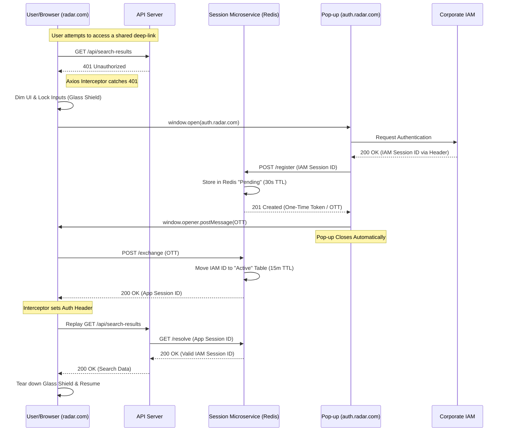

# Case Study: Bypassing Rigid IAM Redirects via Side-Channel Authentication

## Executive Summary
In a large-scale enterprise environment, rigid Identity Access Management (IAM) policies often prioritize global consistency over application-specific user experience. When a mandatory **SAML 301 Redirect** policy threatened to break deep-linking functionality for the search-heavy application "Radar," I designed and implemented a **Side-Channel Token Exchange** microservice. This solution preserved user state, bypassed disruptive redirects, and received full approval from the corporate security audit team.

---

## The Challenge: The "Deep-Link" Dead End
The Radar application relied heavily on users sharing specific search result URLs. However, the corporate IAM service was configured to redirect all successful logins to the application’s root home page.

### The Conflict
*   **User Impact:** If a user clicked a shared link without an active session, they were automatically authenticated and then dumped onto the Home Page, losing the specific search context or details page they intended to view. Additionally, the redirect corrupted browser history, making it impossible for users to navigate back to their entry point.
*   **Organizational Constraint:** Corporate policy prohibited modifying the IAM redirect behavior for individual applications.

---

## The Solution: A Session Microservice
I developed a Node.js microservice backed by Redis to decouple the authentication process from the main application’s navigation flow. This allowed for a "silent" handshake in a background window, ensuring users never lost their place—even if their session timed out mid-task.

### Architecture & Components
The system utilized a **Dual-Hash Strategy** in Redis to manage session lifecycles:
*   **Pending Table (30s TTL):** Maps One-Time Tokens (OTT) to IAM Session IDs.
*   **Active Table (15m TTL):** Maps internal App Session IDs to validated IAM Session IDs.

### The "Pop-up Handshake" Flow
To avoid a top-level page redirect, I implemented a non-intrusive authentication sequence managed via Axios interceptors. When a `401 Unauthorized` response is detected, the application initiates a "Glass Shield" state to lock the UI before opening a small pop-up window pointed at a subdomain behind the IAM wall. Because the user is on a managed workstation, IAM authenticates the pop-up automatically, generating a short-lived **One-Time Token (OTT)**. The pop-up then passes this OTT back to the main window and closes, allowing the main app to exchange it for a persistent session and replay the original failed requests.

---

## Proactive Session Maintenance
To minimize the need for the "Pop-up Handshake," I implemented a sophisticated client-side heartbeat system designed to extend the Redis-backed session sliding window during active use.

*   **Multimodal Activity Tracking:** The system monitored `mousemove`, `keydown`, and internal API calls to detect user presence.
*   **Traffic Optimization (Debouncing):** To prevent unnecessary network overhead, the keep-alive trigger was debounced using a 90-second window.
*   **Intelligent Interception:** I configured a secondary Axios interceptor to monitor successful business-logic API calls. Since every valid request to `/api/*` naturally extended the session in Redis, explicit "keep-alive" calls were terminated if a standard API call returned successfully within the debounce window. This "silent" synchronization ensured the session stayed fresh without wasted bandwidth.

---

## UI Suspension & Recovery
To ensure a non-disruptive experience during session expiration, I implemented a custom state-lock mechanism that protected user progress while enforcing security boundaries.

### The "Glass Shield"
When the session monitor reached its TTL, the application entered a "suspended" state. I used a full-page overlay with 30% opacity and a modal prompt. This acted as a functional "kill-switch," capturing and neutralizing all keyboard and mouse inputs to prevent unauthorized interactions with sensitive data.

### Seamless Resumption
The modal provided a single **"Re-authenticate"** trigger. Upon clicking, the Side-Channel Auth sequence would execute. Once the microservice validated the new session, the system would automatically:
1.  Tear down the "Glass Shield."
2.  Re-enable the activity monitor.
3.  Replay the failed request that originally triggered the 401, allowing the user to continue exactly where they left off without a page reload.

---

## Technical Highlights
*   **Fine-Grained Control:** While the corporate IAM session lasted 22 hours, our microservice enforced a stricter 15-minute sliding window, significantly reducing the attack surface.
*   **Security Validation:** The system passed a full suite of corporate security penetration tests with zero findings. By keeping IAM tokens server-side and only exposing opaque App Session IDs to the client, we improved the overall security posture.
*   **Project Velocity:** This solution was moved from discovery to production in **under two weeks**, navigating both technical development and complex corporate security audits.

---

## Results & Impact
*   **100% Context Retention:** Users never lost "in-flight" work. Even after a complete session timeout, they could resume deep-dive research tasks with a single click.
*   **Zero State Loss:** Deep-linked search results were preserved, and browser history remained clean.
*   **Seamless UX:** For users on managed workstations, the authentication "flicker" lasted less than a second and required zero manual input.